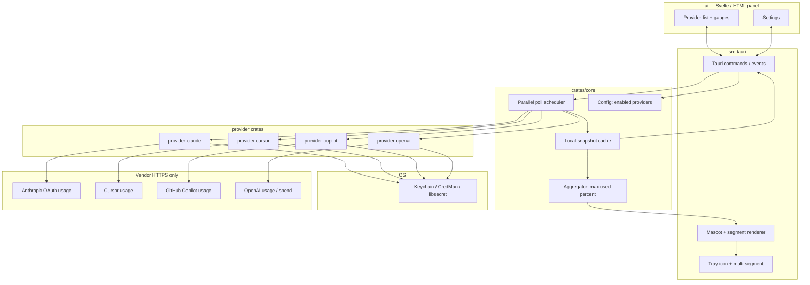

# Quota Tray — Design Specification

| | |
| --- | --- |
| **Working title** | Quota Tray |
| **Date** | 2026-09-02 |
| **Status** | Draft — pending user review of written spec |
| **Supersedes** | Claude Tracker (Laravel + NativePHP macOS menu bar app in this repo) |
| **License intent** | Open source (MIT or equivalent) — credential trust |

---

## 1. Problem / goals / non-goals

### Problem

Developers who use several AI coding assistants (Claude Code, Cursor, GitHub Copilot, and later OpenAI API spend) have no single, honest place to see remaining quota. Each vendor hides usage in a different web dashboard, IDE panel, or undocumented endpoint. Limits reset on different clocks. Hitting a wall mid-session is expensive and disruptive.

Claude Tracker solved this for **one** provider on **macOS**, with a trustworthy local stack and a mascot that fills as you spend. The product truth was right; the platform choice (Laravel + NativePHP/Electron) and single-provider scope are not the long-term shape.

### Goals

1. **One tray, all enabled providers.** A combined system-tray / menu-bar presence whose icon and panel reflect every provider the user has turned on.
2. **Honest readings.** Stale-on-error per provider; never invent zeros; never pretend a failed poll succeeded.
3. **Local-only trust.** Credentials stay on the machine. No Quota Tray servers, no telemetry, no account with us.
4. **Greenfield Tauri rebuild.** Tauri 2 + Rust core + Svelte (or plain HTML) panel. No PHP, no Laravel, no NativePHP, no Electron packaging path for the product.
5. **macOS menubar polish first**, with Windows and Linux tray sharing the same panel UI and interaction model.
6. **Open source** so anyone who grants Keychain / credential-store access can audit what we do with it — same trust bargain as Claude Tracker.
7. **Carry forward the mascot language** (cream + terracotta fill-from-feet creature), generalized so shared fill = **worst healthy provider** = **`max(headline_percent)`** among healthy providers (`headline_percent` is always **% used**, 0–100; higher = fuller / more alarming).

### Non-goals

- Rebuilding or continuing the Laravel + NativePHP Claude Tracker as the shipping product.
- A cloud sync, team dashboard, or hosted multi-user product.
- Official partnerships or blessed SDKs for every vendor (v1 accepts unofficial usage endpoints where necessary; see Risks).
- Full IDE plugins, VS Code extensions, or CLI-first workflows as the primary surface (tray + panel is the product).
- Billing, invoicing, or payment management inside the app.
- Perfect parity with every vendor dashboard field on day one — only the normalized snapshot contract matters for UI.
- Porting PHP classes, Eloquent, Blade, or Laravel cache/broadcast patterns into the new stack.

---

## 2. Users & success criteria

### Primary user

Individual developers on macOS (first), then Windows/Linux, who already authenticate to one or more of: Claude Code, Cursor, GitHub Copilot, and (soon) OpenAI API. They care about not being surprised by a hard stop mid-flow.

### Secondary user

Contributors and security-conscious users who will read the credential and network paths before granting Keychain / secret-store access. Open source is a product requirement for this audience, not a nice-to-have.

### Success criteria

| Criterion | Measure |
| --- | --- |
| At-a-glance awareness | User can read remaining headroom from the tray icon alone (mascot fill + optional label) without opening the panel. |
| Multi-provider truth | Panel lists **all enabled** providers; each row shows that provider’s windows, freshness, and errors independently. |
| Honesty under failure | Killing or breaking one provider’s endpoint leaves that row stale with last-known numbers; other providers keep polling and updating. |
| No fake zeros | A null / missing percent never renders as `0%` with a “live” affordance. |
| Credential locality | Network traces show only vendor endpoints; no Quota Tray backend; secrets never leave local OS stores except as bearer credentials on those vendor calls. |
| Platform feel | On macOS, menubar icon is a proper template-style / high-DPI tray asset; panel opens and positions like a native menubar dropdown. Win/Linux match the same panel layout. |
| Ship order | Claude Code + Cursor + Copilot usable in v1; OpenAI API spend in v1.1 without rewriting the core contract. |

---

## 3. UX

Visual direction: **cream surfaces + terracotta mascot fill**. Provider brand colors appear **only** on provider chips and tray multi-segments — not on the mascot body, not as a rainbow panel chrome.

### 3.1 Combined tray icon

**Decision (approved): combined tray** — one icon, not one tray icon per provider.

- **Multi-segment ring / arc** around or beside the mascot silhouette: one segment per *enabled* provider, colored with that provider’s chip color.
  - Healthy + `headline_percent: Some(p)` → segment fill = `p` (% used).
  - Healthy + `headline_percent: None` → **muted empty segment** still present (provider enabled; no % to paint). Panel shows non-percent windows.
  - Stale / error → dashed / muted segment; last known fill if any, else empty — never a confident live 0%.
- **Shared mascot fill** = **`max(headline_percent)`** among **healthy** providers: not stale, no error, and `headline_percent` is `Some`. (`headline_percent` = % **used**; worst = fullest.)
- **Empty healthy set:** keep **last successful** `shared_mascot_fill` if any, draw mascot **pale/muted** with global stale affordance; if never had a successful combined fill, empty pale body — never fabricate a live 0%.
- Optional menubar **label** (macOS): default = that `max` among healthy (Claude Tracker “number beside icon” habit); blank/tooltip-only remains an open question.
- Tooltip: one line per enabled provider (`Claude 62% · Cursor 41% · Copilot stale`) or a compact equivalent.

### 3.2 Panel — provider list

Primary surface after click: a short list of **all enabled providers**, each as a meter row.

**Reference:** [Rocket Money — provider/list meters](https://mobbin.com/screens/5ee90a6f-5d97-495c-ad2a-d3dd74ab8b7d) — clear named rows, proportional remaining/used bars, secondary metadata without card clutter.

Each row:

- Provider chip (color + short name)
- Headline meter (percent when available; currency/count windows shown as secondary text, not fake percent bars)
- Freshness: Live / Stale + relative “fetched …” when stale
- Error string when present (human, one line)
- Expand or secondary line for that provider’s **windows** (session / week / etc.)

### 3.3 Multi-gauge / dual-window detail

When a provider exposes multiple windows (Claude’s five-hour + seven-day), show them as peer gauges, not a single collapsed number.

**References:**

- [Remote — multi gauge cards](https://mobbin.com/screens/63031996-b350-4fef-a2d4-3c86e9fa40e1) — several related meters with equal visual weight.
- [Gemini — dual windows](https://mobbin.com/screens/1cb3c785-d4df-4a3a-992d-e887d1129667) — two concurrent windows readable at once (maps to Claude Tracker’s “both windows at once” product promise).

Resets-at copy sits under each gauge as quiet secondary text (countdown or absolute local time).

### 3.4 Hero “left” focus

Panel header / hero: mascot large on the **left**, worst-of headline and short status copy on the right — brand-first, one composition.

**Reference:** [Revolut — hero left focus](https://mobbin.com/screens/b578103d-3eca-4520-b50f-1698113428d7).

Do not turn the first viewport into a dashboard of unrelated widgets. Hero job: mascot + “you’re fine / you’re tight / something’s stale” + optional worst percent.

### 3.5 Stacked / segment metaphor

Tray multi-segment and any stacked usage comparison borrow the **stacked bar** language for “several quotas in one glyph.”

**Reference:** [StackAI — stacked bars](https://mobbin.com/screens/a2976bbf-d4f1-407f-8c56-88779215f037).

### 3.6 Settings

Minimal settings window (or panel footer → Settings):

| Setting | Behavior |
| --- | --- |
| Enable / disable provider | Toggles polling and tray segment; **panel lists enabled providers only** (disabled live in Settings toggles, not as disabled rows) |
| Credential status | Connected / missing / expired — with “how to sign in to the vendor app” copy, not our OAuth portal |
| Poll interval | **v1: default 60s, allowed range 60..=120** (same for all providers); per-provider override = post-v1 |
| Headline metric (per provider where relevant) | Claude v1 **default = Highest** (`max(5h, 7d)` used %); optional FiveHour / SevenDay override |
| Launch at login | Platform native |
| Open source / privacy | Link to repo + short “what we read / where it goes” blurb |

No accounts, no cloud toggle, no “send diagnostics.”

### 3.7 Empty & first-run

1. First launch: enable at least one provider; explain Keychain / credential permission prompts.
2. Zero enabled: panel explains enablement; tray shows empty mascot (not a fake 0% fill).
3. Enabled but never successfully polled: row shows waiting / unavailable with error — not zeros.

### 3.8 Interaction model

- Click tray → panel (popover / attached window).
- Click outside or Esc → dismiss.
- Manual refresh control in panel header (optional; does not replace the poller).
- Deep links into vendor dashboards are allowed as external URLs; we do not scrape those pages for the reading.

---

## 4. Architecture

### Stack (approved)

| Layer | Choice |
| --- | --- |
| Shell | **Tauri 2** |
| Core + providers | **Rust** crates |
| Panel / settings UI | **Svelte** (preferred) or static HTML + light JS — no PHP/Laravel |
| Secrets | OS credential stores via Rust (Keychain / Windows Credential Manager / secret-service) |
| Network | Direct HTTPS from Rust to vendor endpoints only |

### Repository layout

```
quota-tray/
  crates/
    core/                 # poller, snapshot types, aggregation, config
    provider-claude/      # Claude Code credentials + usage fetch
    provider-cursor/
    provider-copilot/
    provider-openai/      # v1.1 — API spend
  src-tauri/              # Tauri app, tray, IPC commands, icon paint
  ui/                     # Svelte (or HTML) panel + settings
```

### Runtime diagram



### Polling

- Interval: **default 60s**, clamp **60..=120** in v1 settings (Claude Tracker habit).
- Providers poll **in parallel**.
- Failures are **independent**: one `Err` marks that provider’s last good snapshot stale; others unaffected.
- No global “all zero” fallback on partial failure.

### Aggregation (approved)

`headline_percent` is always **percent used** (0–100). Higher = more spent = worse for the user. Therefore “worst” = **maximum**, not minimum.

```
shared_mascot_fill = max(headline_percent)
  among enabled providers where snapshot is healthy
  (not stale, no error, headline_percent is Some)
```

If the healthy set is empty: reuse last successful `shared_mascot_fill` with muted/stale chrome; if none ever existed, pale empty mascot — never a fabricated live 0%.

### Why not Laravel / NativePHP

- Multi-provider plugins and OS secret access fit Rust better than PHP scheduled commands + Electron IPC.
- Smaller desktop footprint and clearer “no PHP runtime on the user’s machine” story for open-source credential trust.
- Greenfield avoids carrying Blade/Electron/NativePHP constraints into Win/Linux tray work.

---

## 5. Data model

Normalized types live in `crates/core`. Provider crates map vendor JSON → these types and never leak raw vendor shapes into the UI.

```rust
/// Stable id used in config, tray segments, and UI chips.
#[derive(Clone, Debug, PartialEq, Eq, Hash)]
pub enum ProviderId {
    Claude,
    Cursor,
    Copilot,
    OpenAI, // shipped in v1.1; type exists in core from day one
}

#[derive(Clone, Debug)]
pub struct ProviderInfo {
    pub id: ProviderId,
    pub display_name: &'static str,
    /// Chip / segment color only (not mascot fill).
    pub chip_color: &'static str, // e.g. "#C96442" style hex
}

/// One usage window as returned (or derived) for a provider.
#[derive(Clone, Debug)]
pub struct UsageWindow {
    pub id: String,           // "five_hour", "seven_day", "monthly_spend", ...
    pub label: String,        // human
    pub kind: WindowKind,
    pub resets_at: Option<time::OffsetDateTime>,
}

#[derive(Clone, Debug)]
pub enum WindowKind {
    /// 0.0..=100.0 used; None means "vendor did not say"
    Percent { used: Option<f64> },
    Currency { used: Option<f64>, limit: Option<f64>, code: String },
    Count { used: Option<u64>, limit: Option<u64> },
}

#[derive(Clone, Debug)]
pub struct ProviderSnapshot {
    pub provider: ProviderId,
    pub fetched_at: time::OffsetDateTime,
    pub windows: Vec<UsageWindow>,
    /// Drives tray segment + contribution to shared mascot fill.
    pub headline_percent: Option<f64>,
    pub stale: bool,
    pub error: Option<String>,
}

#[derive(Clone, Debug)]
pub struct TrayState {
    pub providers: Vec<ProviderSnapshot>, // enabled only, stable order
    /// max % used among healthy; None if none healthy (see Aggregation)
    pub shared_mascot_fill: Option<f64>,
}

pub trait Provider: Send + Sync {
    fn id(&self) -> ProviderId;
    fn credentials(&self) -> Result<Credentials, CredentialError>;
    fn fetch(&self, creds: &Credentials) -> Result<ProviderSnapshot, FetchError>;
}

/// Opaque per-provider secret material; never logged.
pub struct Credentials {
    pub raw: secrecy::SecretString,
}

#[derive(Clone, Debug)]
pub struct AppConfig {
    /// v1: default 60; settings UI clamps 60..=120
    pub poll_interval_secs: u64,
    pub enabled: Vec<ProviderId>,
    /// v1 default = Highest (max of five_hour / seven_day used %)
    pub claude_headline: ClaudeHeadlineMetric,
}

#[derive(Clone, Debug, Default)]
pub enum ClaudeHeadlineMetric {
    FiveHour,
    SevenDay,
    #[default]
    Highest,
}
```

### Honesty rules (inherited from Claude Tracker, per provider)

1. **Stale-on-error.** On fetch failure, keep last good `windows` / `headline_percent` / `fetched_at`, set `stale = true`, set `error`.
2. **Never fake zeros.** `None` percent ≠ `0.0`. UI must distinguish “unknown / missing” from “empty.”
3. **Unavailable.** If there was never a good reading, snapshot may have empty windows, `stale = true`, and an error such as “Waiting for the first reading” or the concrete failure — still no confident zeros.
4. **Defensive parse.** Every vendor field is optional; unrecognized payloads are fetch failures, not successful empty usage.
5. **No telemetry.** No analytics events, no crash phoning home, no our servers in the path.

### Snapshot → UI mapping

| Field | Tray | Panel |
| --- | --- | --- |
| `headline_percent` (`Some`) | Segment fill; feeds `shared_mascot_fill` if healthy | Row meter |
| `headline_percent` (`None`) | Muted empty segment (provider still shown) | Non-% windows / copy only |
| `windows` | — | Dual / multi gauges |
| `stale` | Segment muted / dashed; excluded from mascot **max** | “Stale” badge |
| `error` | Tooltip | Row error line |

---

## 6. Provider plugins

| Provider | Crate | v1 | Credentials (concrete) | `headline_percent` (v1 formula) | Notes |
| --- | --- | --- | --- | --- | --- |
| Claude Code | `provider-claude` | **v1** | macOS Keychain service **`Claude Code-credentials`**; Linux/Win **`~/.claude/.credentials.json`** (also `$CLAUDE_CONFIG_DIR`) | Default **Highest** = `max(five_hour, seven_day)` % used; optional FiveHour/SevenDay | Unofficial `GET …/api/oauth/usage`; dual windows |
| Cursor | `provider-cursor` | **v1** | SQLite `state.vscdb` key **`cursorAuth/accessToken`** (App Support / `.config` / `%APPDATA%` paths in appendix) | `totalPercentUsed` ?? `max(auto, api)` ?? spend/limit cents | Unofficial dashboard RPC; may break |
| GitHub Copilot | `provider-copilot` | **v1** | Prefer **`~/.config/github-copilot/apps.json`** (Win: `%LOCALAPPDATA%\github-copilot\`); then `gh` hosts / Keychain | **`100 - premium_interactions.percent_remaining`** (skip `unlimited`) | Unofficial `GET /copilot_internal/user`; invert remaining→used |
| OpenAI | `provider-openai` | **v1.1** | User API key in **OS secret store** (optional import from `OPENAI_API_KEY` once) | **`max(RPM%, TPM%)`** from rate-limit headers; **or** optional user **`soft_cap_usd`** vs Costs API spend — **no** prepaid remaining balance API | Official headers/APIs; weak “subscription left” semantics |

### Ship order

1. **Core + Tauri shell + Claude** — proves tray, mascot, stale-on-error, settings, open-source credential story.
2. **Cursor** — second segment + list row; validates multi-provider aggregation.
3. **Copilot** — third v1 provider (polarity: remaining → used).
4. **OpenAI (v1.1)** — rate-limit and/or soft-cap under the same trait; no core redesign.

Exact request headers and parse quirks: **see [`_research-providers.md`](./_research-providers.md)**. This section locks credentials + headline formulas implementers must follow.

### Provider registration

```rust
// crates/core — dynamic list from config + compiled plugins
fn built_in_providers() -> Vec<Box<dyn Provider>> {
    vec![
        Box::new(provider_claude::ClaudeProvider::default()),
        Box::new(provider_cursor::CursorProvider::default()),
        Box::new(provider_copilot::CopilotProvider::default()),
        // OpenAI registered when feature/version ships
    ]
}
```

---

## 7. Platform matrix

| Capability | macOS (priority) | Windows | Linux |
| --- | --- | --- | --- |
| Tray / menubar | Menubar polish first: template-friendly icon, label, popover anchoring | System tray; same panel UI | StatusNotifier / app indicator; same panel UI |
| Secrets | Keychain | Credential Manager | libsecret / secret-service |
| Auto-start | Login item | Startup folder / Task | XDG autostart |
| Icon rendering | Pixel mascot + multi-segment; respect light/dark menubar | Same assets; tray may be color | Same |
| Packaging | `.dmg` / `.app` via Tauri | `.msi` / `.exe` | `.deb` / AppImage as Tauri supports |
| Claude credentials v1 | Keychain read (known path from Claude Tracker) | As research allows; may lag | As research allows; may lag |

**UI parity rule:** Win/Linux get the **same panel and settings**. Platform-specific work is tray hosting, secrets, and installers — not a different information architecture.

**v1 acceptance:** macOS is release-blocking. Windows/Linux may ship when tray + secrets work for at least Claude (or clearly document which providers are macOS-only until stores are wired).

---

## 8. Security & privacy

### Trust bargain (open source)

Quota Tray will ask the OS for credentials other apps already stored (or that the user pastes into the OS secret store). Therefore:

- Credential read + HTTP call sites must be small, reviewable, and named in the README (Claude Tracker set this expectation; keep it).
- License remains open source so users can verify before granting access.

### Rules

| Rule | Detail |
| --- | --- |
| Local only | No Quota Tray backend. No account with us. |
| No telemetry | No usage analytics, no phone-home, no automatic error reports. |
| Secrets | OS stores only; never write tokens into app logs, crash reports, or UI copy. |
| Network | Outbound HTTPS only to vendor endpoints required for `fetch()`. |
| Least retention | In-memory + small on-disk snapshot cache of **usage numbers**, not raw tokens. |
| Permissions | First Keychain / secret access uses OS prompts; document why. |
| Updates | Prefer user-initiated or clearly disclosed update checks; update check must not upload credentials or usage payloads. |

### Threat notes

- Malicious build of Quota Tray could exfiltrate tokens — mitigated by open source + reproducible builds aspirationally; users should prefer builds they compile or checksums from the official repo.
- Unofficial APIs may require tokens with broader scope than “read usage”; document scopes when known and prefer the narrowest available material.

---

## 9. Risks

| Risk | Impact | Mitigation |
| --- | --- | --- |
| Unofficial / undocumented usage APIs change or vanish | Provider goes permanently stale | Defensive parsers; stale-on-error; per-provider disable; README honesty; research appendix kept current |
| Vendor ToS / ToU ambiguity | Legal / account risk for users | Document that we call the same classes of endpoints the vendor apps use where applicable; no scraping of logged-out marketing pages; user responsibility note |
| Missing credentials on Win/Linux | Provider unavailable off macOS | Platform matrix honesty; graceful unavailable state |
| `headline_percent` undefined (no % formula) | Tray segment / mascot math awkward | Allow `None` headline; muted empty segment; **exclude from mascot max**; panel shows RPM/TPM or soft-cap windows; OpenAI must not invent prepaid used/limit |
| Tray icon overcrowding with many providers | Unreadable segments | v1 caps at 3–4 enabled; segment min width; collapse to mascot-only + tooltip if needed |
| Tauri tray API differences across OS | Polish gaps | macOS-first polish budget; shared panel |
| Conflating “0% used” with parse failure | User trust break | Typed `Option`; UI tests for null vs zero |
| Porting pressure from Laravel app | Wrong abstractions | Explicit non-goal: no PHP port; only product rules and Claude credential *behavior* |

---

## 10. Migration from Claude Tracker

Claude Tracker remains the **product reference** for honesty and mascot language. Quota Tray **replaces** it as the intended shipping app.

| From Claude Tracker | Into Quota Tray |
| --- | --- |
| Keychain Claude Code token + Anthropic OAuth usage | `provider-claude` behavior |
| `UsageSnapshot` stale-on-error / no fake zeros | `ProviderSnapshot` + core poller |
| `UsagePoller` 60s cycle | `crates/core` parallel poller |
| `PixelMascot` + `MenuBarIconRenderer` | Rust/icon pipeline in `src-tauri` (same grid art OK to re-encode) |
| Dropdown dual windows | Panel multi-gauge + Gemini/Remote-informed layout |
| Laravel / NativePHP / Electron | **Not ported** |
| Single-provider menubar | Combined multi-segment tray |

### Migration experience for existing Claude Tracker users

- No automatic import of Laravel cache files required.
- On first Quota Tray launch with Claude enabled, read the same Keychain item Claude Code (and Claude Tracker) already use.
- Document side-by-side running: two apps may both poll; recommend quitting Claude Tracker once Quota Tray Claude row is healthy.
- This repo may host the design/specs during transition; the greenfield app may live in `quota-tray/` here or a new repository — packaging choice does not change this design.

---

## 11. Open questions

Only true unknowns remain:

1. **OpenAI v1.1 default mode:** rate-limit RPM/TPM probe vs user `soft_cap_usd` vs Costs API — pick primary at kickoff (no prepaid remaining API exists).
2. **Menubar label default:** worst percent only vs blank label with tooltip-only (macOS width pressure).
3. **Repo home:** continue under `claude-tracker` monorepo vs new `quota-tray` GitHub repo for cleaner open-source naming.
4. **Svelte vs plain HTML** for `ui/` — Svelte preferred; final choice at scaffold time if bundle size or Tauri templates push HTML.

**Resolved by research appendix (no longer open):** Claude / Cursor / Copilot credential paths and usage endpoints per OS — see `_research-providers.md`. Cursor/Copilot remain unofficial and may still force macOS-first QA, but locations are documented.

Decided items (combined tray, stack, **enabled-only** provider list, mascot = **`max` healthy % used**, honesty rules, macOS polish first, OSS, v1/v1.1 ship order, poll 60s default / 60..=120) are **not** open.

---

## 12. Provider research appendix

Detailed credential paths, request shapes, and parser notes:

**See [`_research-providers.md`](./_research-providers.md)** (same directory; research complete 2026-09-02).

§6 already promotes the v1 credential locations and `headline_percent` formulas. The appendix remains the deep reference for endpoints, headers, and edge cases. Parsers must satisfy both.

---

## Appendix A — Visual tokens (initial)

| Token | Role |
| --- | --- |
| Cream background | Panel surface |
| Terracotta | Mascot body fill (spent portion) |
| Pale cream / muted | Mascot unspent portion |
| Provider chip colors | Segments + chips only |
| Muted text | Resets-at, stale, errors |

Mascot grid may reuse Claude Tracker’s 16×16 `B`/`E` art for continuity; eyes stay unfilled by usage so the face remains readable at tray size.

---

## Appendix B — Engineering approval checklist

- [x] Combined tray with multi-segment + **enabled** provider list panel  
- [x] Tauri 2 + Rust + Svelte/HTML; no PHP/Laravel  
- [x] v1 providers: Claude, Cursor, Copilot; OpenAI in v1.1  
- [x] Shared mascot fill = **`max`** healthy `headline_percent` (% used)  
- [x] Stale-on-error, no fake zeros, no telemetry, no our servers  
- [x] macOS menubar first; Win/Linux same UI  
- [x] Open source for credential trust  
- [x] Mobbin-informed UX with citations  
- [x] Plugin trait + normalized snapshot + concrete credential/headline formulas in §6  
- [x] Parallel poll, independent failure  
- [x] Migration path without Laravel port  

**End of specification.**
